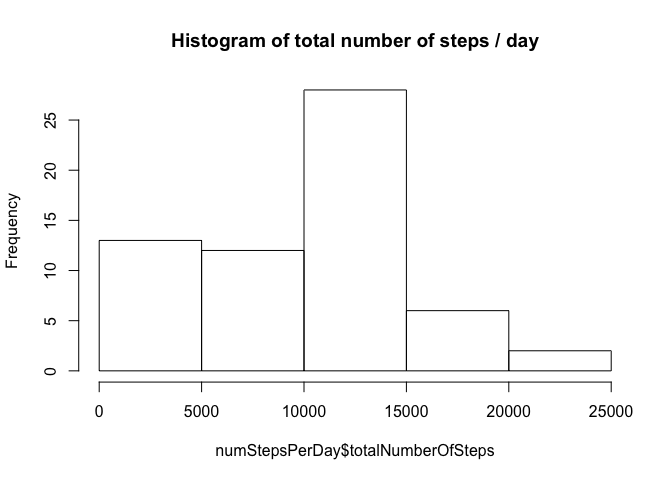
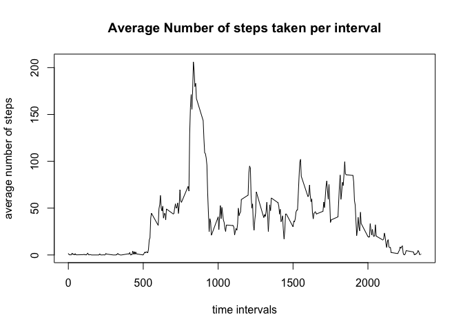
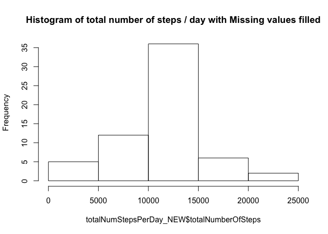
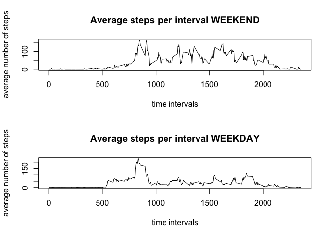

# Reproducible Research: Peer Assessment 1


## Loading and preprocessing the data


```r
  #A Loading and preprocessing the data
  #1. Load the data:
  activityData <- read.csv("activity.csv")
  
  
   #2. Process/transform the data (if necessary) into a format suitable for your analysis
  # there was no need to transform the data
```


## B What is mean total number of steps taken per day?
  

```r
  #1. Calculate the total number of steps taken per day.
  # I used the ddply method from the plyr package and summarized on the "date" variable, and create a new column for the sum
  # of the number of steps taken that day:
  library(plyr)
  numStepsPerDay <- ddply(activityData, .(date), summarise, totalNumberOfSteps = sum(steps, na.rm = TRUE))
  

  #2. Make a histogram of the total number of steps taken each day
  
  # create a figure directory if not available
  
  # create the figure
  par(mfrow = c(1,1))
  #png("figure/totalNumStepsPerDay-B2.png", width=480, height=480, type="quartz")
  hist(numStepsPerDay$totalNumberOfSteps, main = paste("Histogram of total number of steps / day"))
```



```r
  # dev.off()
  
  #3. Calculate and report the mean and median of the total number of steps taken per day
  meanOfTotalNumStepsPerDay <- mean(numStepsPerDay$totalNumberOfSteps, na.rm = TRUE)
  medianOfTotalNumStepsPerDay <- median(numStepsPerDay$totalNumberOfSteps, na.rm = TRUE)
  
  paste ("Mean of the total number of steps per day: ", meanOfTotalNumStepsPerDay)
```

```
## [1] "Mean of the total number of steps per day:  9354.22950819672"
```

```r
  paste ("Median of the total number of steps per day: ", medianOfTotalNumStepsPerDay)
```

```
## [1] "Median of the total number of steps per day:  10395"
```

  
## What is the average daily activity pattern?


```r
  #1 Make a time series plot (i.e. 𝚝𝚢𝚙𝚎 = "𝚕") of the 5-minute interval (x-axis) and
  # the average number of steps taken, averaged across all days (y-axis)
  
  # the goal here is to average the steps taken for EACH interval, e.g. 5, for each day, 10/1/12, 10/2/12 etc
  # and create a summary table . we shall use ddply
  
  avgNumStepsPerDay <- ddply(activityData, .(interval), summarise, averageNumberOfStepsPerInterval = mean(steps, na.rm = TRUE))
  
  # create the figure
  par(mfrow = c(1,1))
  #png("figure/averageNumberStepsPerDay-C1.png", width=480, height=480, type="quartz")
  with(avgNumStepsPerDay, plot(avgNumStepsPerDay$interval  , avgNumStepsPerDay$averageNumberOfStepsPerInterval, main = "Average Number of steps taken per interval", xlab = "time intervals", ylab = "average number of steps", type = "l"))
```



```r
  #dev.off()
  
  
  # 2 Which 5-minute interval, on average across all the days in the dataset, contains the maximum number of steps?
  
  #lets find which slot is max:
  maxSlot <- avgNumStepsPerDay$interval[which.max(avgNumStepsPerDay$averageNumberOfStepsPerInterval)]
  
  maxHour <- maxSlot %/% 60
  maxMinutes <- maxSlot %% 60
  
  paste("the 5 minute time slot with the max # of steps is at hour: ", maxHour, "and minute:", maxMinutes)
```

```
## [1] "the 5 minute time slot with the max # of steps is at hour:  13 and minute: 55"
```


## Imputing missing values


```r
  # 1 Calculate and report the total number of missing values in the dataset (i.e. the total number of rows with 𝙽𝙰s)
  
  
  numberOfMissingValues = length(activityData[is.na(activityData)])
  paste("number of missing values in the data set is ", numberOfMissingValues)
```

```
## [1] "number of missing values in the data set is  2304"
```

```r
  # 2 Devise a strategy for filling in all of the missing values in the dataset. The strategy does not need 
  # to be sophisticated. For example, you could use the mean/median for that day, or the mean for that 5-minute interval, etc.
  
  # we will use the mean(average) of that 5-minute interval to fill the n/a values in the dataset.
  # logic: first, find the NA, then look its corresponding interval (x), and use (x) to look up the mean in "avgNumStepsPerDay", calculated earlier.
  # then replace NA with that value.
  
  # boolean format of all NA data:
  bad <- is.na(activityData)
  
  # identify the indices with the NA data:
  rowNumberIndicesForAllNAData <- which(bad[, 1])
  
  # use these indices to pull out corresponding intervals, and then the corresponding avg # of steps for those intervals:
  # first create the new data set:
  activityData_noNA <- activityData
  for (i in rowNumberIndicesForAllNAData)
  {
    # for each iteration, first find the corresponding interval for the bad index, 
    # and then find the average number of steps for corresponding interval. Then save this value in place of the original NA value
    
    avgValue <- avgNumStepsPerDay$averageNumberOfStepsPerInterval[avgNumStepsPerDay$interval == activityData$interval[i]]
    activityData_noNA$steps[i] <- avgValue
    
  }
  
  
  
  # 2 Create a new dataset that is equal to the original dataset but with the missing data filled in.
  
  # done earlier
  
  # 3 Make a histogram of the total number of steps taken each day (WITH THE NEW FILLED ACTIVITY DATA:)
  
  totalNumStepsPerDay_NEW <- ddply(activityData_noNA, .(date), summarise, totalNumberOfSteps = sum(steps, na.rm = TRUE))
  
  # create the figure
  par(mfrow = c(1,1))
  #png("figure/totalNumStepsPerDay-D3.png", width=480, height=480, type="quartz")
  hist(totalNumStepsPerDay_NEW$totalNumberOfSteps, main = paste("Histogram of total number of steps / day with Missing values filled"))
```



```r
  #dev.off()
  
  
  # Calculate and report the mean and median total number of steps taken per day. Do these values differ from the estimates from the 
  # first part of the assignment? 
  
  newMeanOfTotalNumStepsPerDay <- mean(totalNumStepsPerDay_NEW$totalNumberOfSteps, na.rm = TRUE)
  newMedianOfTotalNumStepsPerDay <- median(totalNumStepsPerDay_NEW$totalNumberOfSteps, na.rm = TRUE)
  
  paste ("Mean of the total number of steps per day with imputed missing values : ", newMeanOfTotalNumStepsPerDay)
```

```
## [1] "Mean of the total number of steps per day with imputed missing values :  10766.1886792453"
```

```r
  paste ("Median of the total number of steps per day with imputed missing values: ", newMedianOfTotalNumStepsPerDay)
```

```
## [1] "Median of the total number of steps per day with imputed missing values:  10766.1886792453"
```

```r
  # What is the impact of imputing missing data on the estimates of the total daily number of steps?
  
  # the impact of imputing the missing data is that the total # of steps in the early part of the day (13->5) were calculated less and the middle of the
  # were much more (27->35)
```


## Are there differences in activity patterns between weekdays and weekends?


```r
  # 0  first we create another DF where we will add a weekday column:
  activityData_noNA_with_weekdays <- activityData_noNA
  
  # then we add that column!
  activityData_noNA_with_weekdays$weekdays <- weekdays(as.Date(activityData_noNA$date))
  
  # now we will calculate averageDailyStepsDuringWeekend 
  
  # first total steps each day:
  satSteps <- sum(activityData_noNA_with_weekdays$steps[activityData_noNA_with_weekdays$weekdays == "Saturday"])
  sunSteps <- sum(activityData_noNA_with_weekdays$steps[activityData_noNA_with_weekdays$weekdays == "Sunday"])
  
  monSteps <- sum(activityData_noNA_with_weekdays$steps[activityData_noNA_with_weekdays$weekdays == "Monday"])
  tueSteps <- sum(activityData_noNA_with_weekdays$steps[activityData_noNA_with_weekdays$weekdays == "Tuesday"])
  wedSteps <- sum(activityData_noNA_with_weekdays$steps[activityData_noNA_with_weekdays$weekdays == "Wednesday"])
  thuSteps <- sum(activityData_noNA_with_weekdays$steps[activityData_noNA_with_weekdays$weekdays == "Thursday"])
  friSteps <- sum(activityData_noNA_with_weekdays$steps[activityData_noNA_with_weekdays$weekdays == "Friday"])
  
  avgWeekendSteps <- mean(c(satSteps,sunSteps))
  avgWeekdaySteps <- mean(c(monSteps, tueSteps, wedSteps, thuSteps, friSteps))
  
  paste ("average number of daily steps on weekend are: ", avgWeekendSteps)
```

```
## [1] "average number of daily steps on weekend are:  97612.1886792453"
```

```r
  paste ("average number of daily steps on weekday are: ", avgWeekdaySteps)
```

```
## [1] "average number of daily steps on weekday are:  92302.6264150943"
```

```r
  # 1 Create a new factor variable in the dataset with two levels – “weekday” and “weekend” indicating whether a given date is a weekday or weekend day.
  
  activityData_noNA_with_weekdays$weekdayFactor[activityData_noNA_with_weekdays$weekdays == "Saturday"] <- "weekend"
  activityData_noNA_with_weekdays$weekdayFactor[activityData_noNA_with_weekdays$weekdays == "Sunday"] <- "weekend"
  
  activityData_noNA_with_weekdays$weekdayFactor[activityData_noNA_with_weekdays$weekdays == "Monday"] <- "weekday"
  activityData_noNA_with_weekdays$weekdayFactor[activityData_noNA_with_weekdays$weekdays == "Tuesday"] <- "weekday"
  activityData_noNA_with_weekdays$weekdayFactor[activityData_noNA_with_weekdays$weekdays == "Wednesday"] <- "weekday"
  activityData_noNA_with_weekdays$weekdayFactor[activityData_noNA_with_weekdays$weekdays == "Thursday"] <- "weekday"
  activityData_noNA_with_weekdays$weekdayFactor[activityData_noNA_with_weekdays$weekdays == "Friday"] <- "weekday"
  
  
  
  # 2 Make a panel plot containing a time series plot (i.e. /.?𝚝𝚢𝚙𝚎 = "𝚕") of the 5-minute interval (x-axis) and
  # the average number of steps taken, averaged across all weekday days or weekend days (y-axis). See the README file in the GitHub repository to see an example of what this plot should look like using simulated data.
  

  avgNumStepsPerDayWeekdayAndWeekend <- ddply(activityData_noNA_with_weekdays, .(interval, weekdayFactor), summarise, averageNumberOfStepsPerIntervalWeekend = mean(steps, na.rm = TRUE))
  
  
  
  # create the figures for WEEKEND AND WEEKDAY

  #png("figure/averageNumberStepsPerWeekendAndWeekday-E2.png", width=480, height=480, type="quartz")
  par(mfrow = c(2,1))
  with(avgNumStepsPerDayWeekdayAndWeekend, plot(avgNumStepsPerDayWeekdayAndWeekend$interval[avgNumStepsPerDayWeekdayAndWeekend$weekdayFactor == "weekend"]  , avgNumStepsPerDayWeekdayAndWeekend$averageNumberOfStepsPerInterval[avgNumStepsPerDayWeekdayAndWeekend$weekdayFactor == "weekend"], main = "Average steps per interval WEEKEND", xlab = "time intervals", ylab = "average number of steps", type = "l"))
  with(avgNumStepsPerDayWeekdayAndWeekend, plot(avgNumStepsPerDayWeekdayAndWeekend$interval[avgNumStepsPerDayWeekdayAndWeekend$weekdayFactor == "weekday"]  , avgNumStepsPerDayWeekdayAndWeekend$averageNumberOfStepsPerInterval[avgNumStepsPerDayWeekdayAndWeekend$weekdayFactor == "weekday"], main = "Average steps per interval WEEKDAY", xlab = "time intervals", ylab = "average number of steps", type = "l"))
```



```r
  #dev.off()
```


